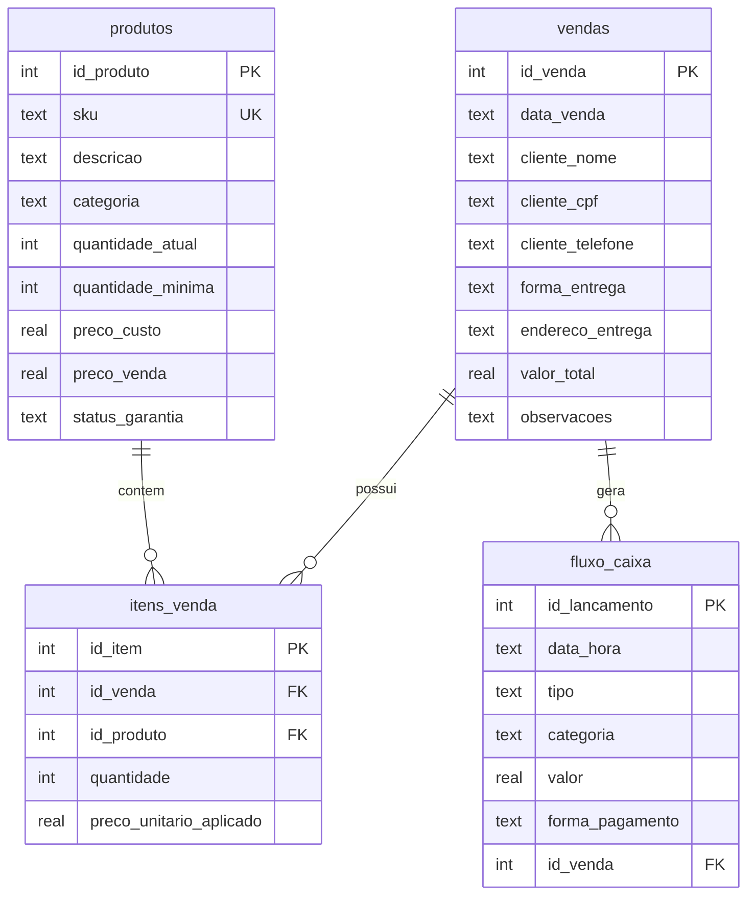

# 🏬 MEGA OUTLET — Sistema de Gestão

Sistema de **estoque, vendas (PDV) e fluxo de caixa** para loja de móveis e
eletroeletrônicos, conforme o documento de requisitos do projeto —
disponível em **duas implementações**:

| Versão | Tecnologia | Onde está | Como usar |
|---|---|---|---|
| **Web local** | Python + Streamlit + SQLite | raiz deste repositório | instruções abaixo |
| **Google Sheets** | Google Apps Script + HTML/CSS | pasta [`google-apps-script/`](google-apps-script/) | [guia de instalação](google-apps-script/README.md) |

As duas versões implementam as mesmas regras de negócio (baixa automática de
estoque, entrada automática no caixa, venda sob encomenda e aviso legal de
outlet). O restante deste README descreve a **versão Python/Streamlit**.

## Como executar

```bash
# 1. Instalar dependências
pip install -r requirements.txt

# 2. (Opcional) Popular o banco com produtos de demonstração
python -m mega_outlet.seed

# 3. Iniciar a aplicação
streamlit run app.py
```

O banco SQLite é criado automaticamente em `data/mega_outlet.db` na primeira
execução (o caminho pode ser alterado com a variável de ambiente
`MEGA_OUTLET_DB`).

### Primeiro acesso e usuários

O sistema exige **login e senha**. Na primeira execução (nenhum usuário
cadastrado), qualquer tela exibe o formulário de **primeiro acesso** para
criar a conta do Administrador — depois disso, todo usuário é cadastrado na
tela **👤 Usuários**. As senhas são armazenadas apenas como hash
PBKDF2-SHA256 (nunca em texto puro), e cada venda/lançamento registra qual
usuário o executou.

| Perfil | Pode |
|---|---|
| **Administrador** | Tudo: PDV, estoque (cadastro/reposição), fluxo de caixa, dashboard completo e gestão de usuários |
| **Vendedor** | PDV, recibos, consulta de estoque e dashboard de faturamento (sem saldo do caixa) |

### Testes

```bash
python -m unittest discover -s tests -v
```

## Telas

| Tela | Arquivo | Função |
|---|---|---|
| **Dashboard** | `app.py` | Faturamento diário/mensal, saldo do caixa e alerta de reposição |
| **PDV** | `pages/1_PDV.py` | Busca de produto, carrinho, dados do cliente e "Finalizar Venda" |
| **Estoque** | `pages/2_Estoque.py` | Cadastro de produtos, listagem e reposição |
| **Fluxo de Caixa** | `pages/3_Fluxo_de_Caixa.py` | Lançamentos manuais (despesas) e extrato — só Administrador |
| **Recibos** | `pages/4_Recibos.py` | Reimpressão do recibo de qualquer venda |
| **Usuários** | `pages/5_Usuarios.py` | Cadastro, senha e ativação de usuários — só Administrador |

## Arquitetura

```
MEGA-OUTLET/
├── app.py                     # Dashboard (página inicial do Streamlit)
├── pages/                     # Demais telas (PDV, Estoque, Caixa, Recibos)
├── mega_outlet/
│   ├── autenticacao.py        # Login, primeiro acesso e controle por perfil (UI)
│   ├── constants.py           # Enums e textos de domínio (formas de pagamento etc.)
│   ├── database.py            # Conexão SQLite + DDL das tabelas
│   ├── erros.py               # Exceções de negócio
│   ├── seed.py                # Dados de demonstração
│   └── services/              # Regras de negócio (sem dependência de Streamlit)
│       ├── produtos.py        # Cadastro, busca e reposição de estoque
│       ├── usuarios.py        # Usuários: hash de senha, autenticação, perfis
│       ├── vendas.py          # ⭐ registrar_venda — transação atômica
│       ├── caixa.py           # Lançamentos, saldo, faturamento, extrato
│       └── recibo.py          # Recibo HTML para impressão/PDF
└── tests/
    ├── test_usuarios.py       # Testes de login, senha e perfis
    └── test_vendas.py         # Testes das regras de negócio críticas
```

## Banco de dados (SQLite)



## Regras de negócio implementadas

Todas em `mega_outlet/services/vendas.py`, na função **`registrar_venda`**,
que roda como **uma única transação SQLite** (tudo ou nada):

1. **Validação de Saldo (3.1)** — bloqueia venda acima do estoque disponível;
   a opção *Sob Encomenda* permite a venda mesmo assim (o saldo fica negativo,
   representando as unidades a encomendar).
2. **Baixa Automática (3.1)** — a quantidade vendida é subtraída do estoque
   na confirmação, com `UPDATE` condicional que protege contra venda
   simultânea em dois caixas.
3. **Status Especial (3.1)** — vendas com produto de mostruário/outlet
   (status de garantia "Sem garantia / No estado") recebem automaticamente o
   aviso legal *"Peças vendidas no estado em que se encontram, sem troca e sem
   garantia."* nas observações.
4. **Vínculo com Caixa (3.2)** — toda venda confirmada gera um lançamento de
   **Entrada** no fluxo de caixa, herdando o valor total e a forma de
   pagamento, vinculado pela chave `id_venda`.
5. **Conciliação (3.2)** — a tela *Fluxo de Caixa* permite lançamentos
   manuais de Saída (fornecedor, custos fixos, pró-labore).

Se qualquer passo falhar, **nada é gravado** — estoque, vendas e caixa nunca
ficam inconsistentes entre si.
